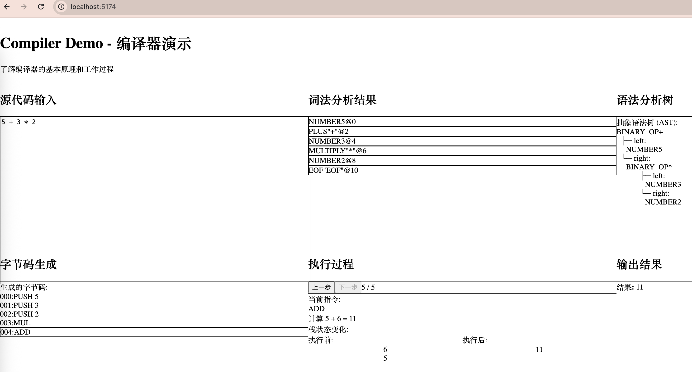

# Compiler Demo - Interactive Compiler Visualization

An interactive web-based compiler demonstration that helps beginners understand compiler principles through complete compilation process visualization of mathematical expressions.

## 📸 Interface Preview



> **6-Panel Real-time Visualization**: Lexical Analysis → Syntax Analysis → AST Display → Bytecode Generation → Execution Process → Output Results

## 🚀 Quick Start

```bash
# Quick setup
git clone https://github.com/guangliangyang/compiler-test.git
cd compiler-test
npm install && npm run dev
# Visit http://localhost:5173/
```

**Try these expressions:**
- `5 + 3 * 2` → See operator precedence in action
- `(5 + 3) * 2` → See how parentheses change results
- `2^3` → Experience power operations
- Use step buttons to observe stack changes in real-time!

## 🎯 Key Features

- **6-Panel Real-time Visualization** - Complete display of every compilation stage
- **Step-by-step Execution Debugging** - Observe virtual machine execution process step by step
- **Stack State Tracking** - Real-time display of stack changes
- **Educational Interface** - Designed specifically for compiler theory teaching
- **Interactive Learning** - Immediate feedback for better understanding

## 🛠️ Installation & Setup

### Local Development

```bash
# Clone the repository
git clone https://github.com/guangliangyang/compiler-test.git
cd compiler-test

# Install dependencies
npm install

# Start development server
npm run dev

# Open in browser
http://localhost:5173/
```

### Production Build

```bash
npm run build
npm run preview
```

## 📊 Feature Showcase

### Supported Mathematical Expressions

```javascript
5 + 3 * 2        // Operator precedence: result = 11
(10 - 4) / 2     // Parentheses expression: result = 3
2^3              // Power operation: result = 8
-5 + 3           // Unary operator: result = -2
3.14 * 2         // Floating point: result = 6.28
((2 + 3) * 4)    // Nested parentheses: result = 20
```

### 6 Visualization Panels

1. **Source Code Input** - Code editing area
2. **Lexical Analysis Results** - Colorized token display
3. **Syntax Analysis Tree** - AST tree structure visualization
4. **Bytecode Generation** - Stack-based instruction list with current instruction highlighting
5. **Execution Process** - Step-by-step debugging with stack state comparison
6. **Output Results** - Final calculation results

## 🛠️ Technology Stack

- **Frontend Framework**: React 19 + TypeScript
- **Build Tool**: Vite 7
- **Styling Framework**: Tailwind CSS 4
- **Compiler**: Custom-built lexer, parser, and code generator
- **Virtual Machine**: Stack-based bytecode execution engine

## 📚 Educational Value

### Core Compiler Concepts Demonstration

- **Lexical Analysis**: Source Code → Token Stream
- **Syntax Analysis**: Token Stream → AST Syntax Tree
- **Code Generation**: AST → Bytecode Instructions
- **Code Execution**: Bytecode → Stack-based Virtual Machine Execution

### Learning Highlights

- 🔍 **Visual Learning** - Intuitive display of every compilation stage
- 🐛 **Debugging Experience** - Step-by-step execution with stack observation
- 🎯 **Precedence Understanding** - See why `5+3*2=11` instead of `16`
- 💡 **Principle Revelation** - Understand how compilers actually work

## 📁 Project Structure

```
src/
├── components/          # React Components
│   ├── CodeEditor.tsx   # Code editor
│   ├── TokenDisplay.tsx # Token display
│   ├── ASTDisplay.tsx   # AST visualization
│   ├── BytecodeDisplay.tsx # Bytecode display
│   ├── ExecutionDisplay.tsx # Execution process
│   └── OutputDisplay.tsx # Result output
├── compiler/           # Compiler Core
│   ├── lexer.ts        # Lexical analyzer
│   ├── parser.ts       # Syntax parser
│   ├── codegen.ts      # Code generator
│   ├── vm.ts           # Virtual machine
│   └── stepvm.ts       # Step-by-step virtual machine
├── types/              # Type definitions
└── App.tsx             # Main application
```

## 🎓 Usage Examples

1. **Try Basic Operations**: Input `5 + 3 * 2`
   - Observe Tokens: `[NUMBER(5), PLUS(+), NUMBER(3), MULTIPLY(*), NUMBER(2)]`
   - View AST: Multiplication node on the right side of addition node (precedence)
   - Execution Steps: `PUSH 5` → `PUSH 3` → `PUSH 2` → `MUL` → `ADD`

2. **Parentheses Change Precedence**: Input `(5 + 3) * 2`
   - AST Structure Change: Addition node on the left side of multiplication node
   - Execution Order: Calculate addition in parentheses first, then multiplication

3. **Step-by-step Debugging**: Use "Previous"/"Next" buttons
   - Observe stack state changes at each step
   - Understand how stack-based computers work

## 🤝 Contributing

Welcome to submit Issues and Pull Requests to improve this project!

## 📄 License

MIT License

## 📞 Contact

For questions or suggestions, please create an Issue or contact the project maintainers.
